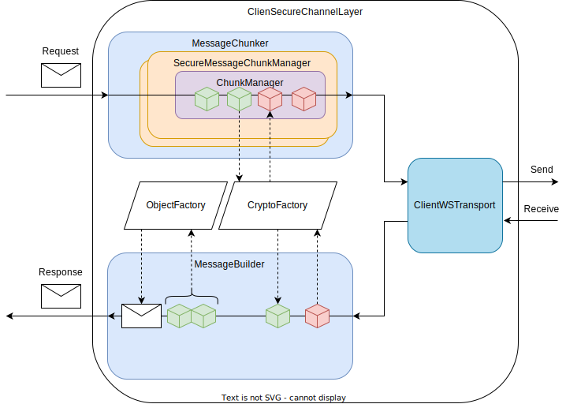

# Simple Client Usage Flow

The following chart shows a typical workflow when using wsopcua:

1. **Create an Instance of OPCUAClient**:
   Instantiate the `OPCUAClient` with the desired configuration settings such as security mode, security policy, and connection strategy.

2. **Establish a Secure Connection**:
   Use the `OPCUAClient` instance to establish a secure connection to your OPC UA server. This involves setting up a secure channel to ensure encrypted communication.

3. **Create a Session**:
   Once connected, create a session using the `OPCUAClient` instance. A session represents a context for communication with the server and is used to perform various operations.

4. **Use the ClientSession Instance**:
   With the `ClientSession` instance, you can now use any of the provided OPC UA service sets. These include:
     - **Read/Write Values**: Read or write values of nodes in the server's address space.
     - **Browse Nodes**: Browse the server's address space to discover nodes and their attributes.
     - **Subscribe to Data Changes**: Monitor changes to node values by setting up subscriptions and monitored items.
     - **Call Methods**: Invoke methods on nodes that support method calls.
     - **Translate Browse Paths**: Translate human-readable browse paths to node IDs.

5. **Close the Session**:
   After completing the desired operations, close the session to release resources on the server.

6. **Disconnect the Client**:
   Finally, disconnect the `OPCUAClient` instance from the server to terminate the secure connection.

# Sending / Receiving Messages

When using wsopcua, communication with the OPC UA server is done through sending requests and receiving responses. Here is a brief overview of how this process works:

1. **Client Secure Channel Layer**:
   The client initiates a secure channel to ensure that all communication between the client and the server is encrypted and secure.

2. **Message Chunker**:
   The client uses a message chunker to break down large messages into smaller chunks that can be sent over the network. This is necessary because OPC UA messages can be quite large and may need to be transmitted in smaller pieces.

3. **Secure Message Chunk Manager**:
   The secure message chunk manager handles the encryption and signing of each message chunk to ensure data integrity and confidentiality.

4. **Chunk Manager**:
   The chunk manager is responsible for managing the individual chunks of a message, ensuring they are correctly assembled and processed.

5. **Crypto Factory**:
   The crypto factory provides cryptographic functions such as encryption, decryption, signing, and verification. It ensures that the messages are securely transmitted and received.

6. **Client WebSocket Transport**:
   The client uses WebSocket transport to send and receive messages over the network. WebSockets provide a full-duplex communication channel that is ideal for real-time communication.

7. **Request and Response**:
   - **Request**: The client sends a request message to the server. This message is processed through the secure channel, chunked, encrypted, and transmitted over the WebSocket.
   - **Response**: The server processes the request and sends a response message back to the client. The response is received over the WebSocket, decrypted, reassembled from chunks, and processed through the secure channel.

8. **Message builder**
   The message builder is responsible for assembling the the
   response objects.
   It uses CryptoFactory to decrypt the received chunks.
   Then the chunks are combined to a message

9. **Object Factory**: 
   The object factory then instanciates response objects
   from the received messages