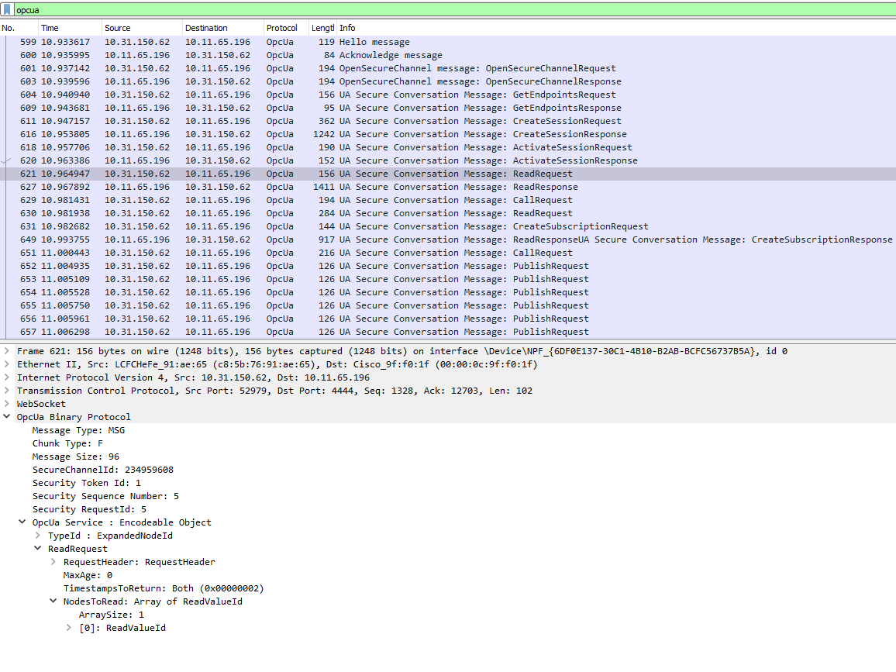

# Debugging with wireshark

If you are familiar with wireshark the following lua script could be handy.
It makes it possible to dissect OPC-UA over websocket.

```lua
local tcp_dissector_table = DissectorTable.get("tcp.port")
local opcua_dissector = tcp_dissector_table:get_dissector(4840)

local ws_proto_dissector_table = DissectorTable.get("ws.protocol")
ws_proto_dissector_table:add('opcua+uacp', opcua_dissector)

local ws_dissector_table = DissectorTable.get("ws.port")
ws_dissector_table:add(4444,opcua_dissector)
```

Change the Port `4444` to your used websocket port (in case you are not using the `opcua+uacp` sub-protocol).

You can evaluate the above lua script in Wireshark by pasting it in
`Tools > Lua > Evaluate`.

Alternatively you can put these view lines into a file with the `.lua` ending and paste
it into one of Wireshark's plugin folders

> You can find the Plugin-Folders in Wireshark in
> <b>Help > About Wireshark > Folders</b>

<b>Hint</b>

> Restart your Application in order to make Wireshark detect the WebSocket connection


